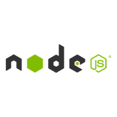
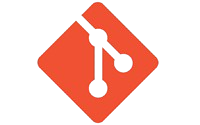

# 📘 Manual do Portfólio

Este guia mostra-te o processo de configuração e personalização do teu portfólio.

---

[Ferramentas Essenciais para o Windows](#ferramentas-essenciais-para-o-windows)

[Configuração e Comandos](#-configuração-e-comandos)

[Personalizar Conteúdo](#️-personalizar-conteúdo)

## 💻 Ferramentas Essenciais para o Windows

Para começares a trabalhar no código do teu portfólio, precisas de ter estas ferramentas instaladas no teu computador:

### 1. Editor de Código (Visual Studio Code)

O **VS Code** é o editor de código que te vai permitir abrir, ver e editar todos os ficheiros do teu portfólio.

<br>
<p align="center">
    <a href="https://apps.microsoft.com/detail/XP9KHM4BK9FZ7Q?hl=pt-PT&gl=PT&ocid=pdpshare">
        
    </a>
    <br><br> Clica no ícone para fazer o download do Visual Studio Code
</p>

### 2. Ambiente de Execução (Node.js)

O **Node.js** é essencial porque o projeto usa ferramentas e dependências JavaScript (como o npm). É a plataforma que permite executar o projeto.

> Requisito: O portfólio requer o Node.js na versão **v18.17+**.
>
> Instala a versão LTS (Long Term Support) do Node.js a partir do site oficial.


<br>
<p align="center">
    <a href="https://nodejs.org">
        
    </a>
    <br><br> Clica no ícone para fazer o download do Visual Studio Code
</p>

### 3. Sistema de Controlo de Versões (Git)

O **Git** é uma ferramenta que te permite acompanhar as alterações no teu código ao longo do tempo. É essencial para *clonar* o repositório e para trabalhar com o GitHub.

> **Função:** Permite-te guardar "cópias" do teu projeto em diferentes estados (versões), reverter erros e colaborar. Além disso, é o que te permite correr o comando **`git clone`** para **ir buscar o código do portfólio para o teu computador** a partir do repositório.
>
> **Instalação:** Podes instalar o Git a partir do site oficial, ou ele já pode vir incluído no teu VS Code ou ambiente de desenvolvimento (especialmente se usares Linux ou macOS). Depois de instalado no Windows, **podes usar os comandos Git diretamente na linha de comandos (CMD) ou no terminal do PowerShell.**

<br>
<p align="center">
    <a href="https://git-scm.com/">
        
    </a>
    <br><br> Clica no ícone para fazer o download do Visual Studio Code
</p>

---

## 🚀 Configuração e Comandos

Depois de teres as ferramentas instaladas, podes começar a configurar o projeto.

### 1. Clonar o Repositório

Começa por copiar o código-fonte do portfólio para o teu computador.

```
git clone https://github.com/once-ui-system/magic-portfolio.git
```

### 2. Instalar as Dependências

Navega até à pasta do projeto e instala todas as bibliotecas e pacotes necessários, usando o npm (que veio com o Node.js).

```
npm install
```

### 3. Iniciar o Servidor de Desenvolvimento

Executa o servidor local para veres o portfólio a funcionar no teu navegador enquanto fazes as edições.

```
npm run dev
```

---

## 🛠️ Personalizar Conteúdo

Estes são os ficheiros onde irás passar a maior parte do tempo a personalizar o portfólio com as tuas informações.

### 4. Editar a Configuração de Estilo (Once UI)

Ajusta as definições globais de estilos e componentes aqui.

Caminho do ficheiro: src/resources/once-ui.config.js

### 5. Editar o Conteúdo Principal

Este ficheiro contém as tuas informações pessoais, secções principais, etc.

Caminho do ficheiro: src/resources/content.js

### 6. Criar Posts de Blog e Projetos

Para adicionares novos artigos ou projetos, cria um novo ficheiro com a extensão .mdx nos diretórios corretos:

* Para Posts do Blog: src/app/blog/posts/teu-post.mdx
* Para Projetos: src/app/work/projects/teu-projeto.mdx


---

---  

## ✍️ Criar, Editar e Eliminar Posts do Blog  

Podes **criar, editar e eliminar posts** adicionando, modificando ou removendo ficheiros `*.mdx` no diretório:  

src/app/blog/posts  

---

## 🧾 Frontmatter  

O *frontmatter* é utilizado para definir os **metadados** de cada post — como o título, descrição, imagem e tags.  
Estas informações são usadas tanto na página do post como nas *meta tags* e *open graph tags*.  

<CodeBlock
    marginBottom="16"
    codes={[
      {
        code:
`---
title: "Atingir um novo marco na minha carreira"
publishedAt: "2024-04-08"
image: "/images/gallery/img-02.jpg"
summary: "Toda a carreira é uma jornada, cheia de desafios, crescimento e momentos significativos que marcam mudanças no nosso percurso."
tag: "Diário"
---`,
        language: "tsx",
        label: "src/app/blog/posts/post-1.mdx"
      }
    ]}
/>

---

## 💡 Sintaxe MDX  

O formato **MDX** permite-te escrever conteúdo dinâmico e rico com uma estrutura simples.  
Alguns elementos MDX são automaticamente convertidos em **componentes Once UI**, para manter a coerência visual e adicionar funcionalidades extra.  

---

## 🧩 Componentes Personalizados  

Podes usar **componentes personalizados** nos ficheiros MDX, mas precisas primeiro de os importar no ficheiro:  

src/components/mdx.tsx  

<CodeBlock
    marginBottom="16"
    highlight="11-12"
    codes={[
      {
        code:
`const components = {
    p: createParagraph as any,
    h1: createHeading(1) as any,
    h2: createHeading(2) as any,
    h3: createHeading(3) as any,
    h4: createHeading(4) as any,
    h5: createHeading(5) as any,
    h6: createHeading(6) as any,
    img: createImage as any,
    a: CustomLink as any,
    Table,
    CodeBlock,
};`,
        language: "tsx",
        label: "src/components/mdx.tsx"
      }
    ]}
/>

Os componentes `Table` e `CodeBlock` já estão incluídos e prontos a usar.  
Se quiseres adicionar mais, basta importá-los neste ficheiro e adicioná-los ao objeto `components`.  

---

## 🔄 Atualização Automática  

O **Hot Reload** para ficheiros MDX **ainda não é suportado**, mas está previsto para versões futuras.  

---

---  

## 🧱 Utilizar Componentes Personalizados em Markdown  

O Magic Portfolio substitui alguns elementos HTML padrão por **componentes Once UI**, para melhor integração visual e funcionalidades adicionais.  
Muitos componentes Once UI comuns já estão importados e prontos a usar.  

---

## 💬 Feedback  

O componente **Feedback** é usado para mostrar informações importantes aos visitantes.  

<Column fillWidth gap="-1" marginBottom="16" marginTop="8">
<CodeBlock
    radius="none"
    topRadius="l"
    codeHeight={24}
    preview={<Feedback icon title="Elemento de Feedback" variant="success" description="Descrição mais detalhada da mensagem de feedback." marginBottom="24"/>}
    codes={[
      {
        code:
`<Feedback
    icon
    variant="success"
    title="Elemento de Feedback"
    description="Descrição mais detalhada da mensagem de feedback."
/>`,
        language: "tsx",
        label: "Feedback"
      }
    ]}
/>
<Row fillWidth bottomRadius="l" padding="4" border="neutral-medium" background="surface">
    <Button href="https://once-ui.com/docs/feedback" weight="default" label="Ver na Once UI" size="s" variant="tertiary" suffixIcon="chevronRight"/>
</Row>
</Column>

---

## 📊 Tabela  

As **Tabelas** são usadas para apresentar dados de forma estruturada.  

<Column fillWidth gap="-1" marginBottom="16" marginTop="8">
<CodeBlock
    radius="none"
    topRadius="l"
    preview={
    <Table 
      data={{
        headers: [
          { content: "Nome", key: "name", sortable: true },
          { content: "Tipo", key: "type", sortable: true },
          { content: "Descrição", key: "description" }
        ],
        rows: [
          ["title", "string", "O título do documento"],
          ["summary", "string", "Um breve resumo do conteúdo"],
          ["updatedAt", "string", "A data da última atualização"],
          ["navLabel", "string", "O rótulo usado na navegação"]
        ]
      }}
    />}
    codes={[
      {
        code:
`<Table 
    data={{
      headers: [
        { content: "Nome", key: "name", sortable: true },
        { content: "Tipo", key: "type", sortable: true },
        { content: "Descrição", key: "description" }
      ],
      rows: [
        ["title", "string", "O título do documento"],
        ["summary", "string", "Um breve resumo do conteúdo"],
        ["updatedAt", "string", "A data da última atualização"],
        ["navLabel", "string", "O rótulo usado na navegação"]
      ]
    }}
/>`,
        language: "tsx",
        label: "Tabela"
      }
    ]}
/>
<Row fillWidth bottomRadius="l" padding="4" border="neutral-medium" background="surface">
    <Button href="https://once-ui.com/docs/table" weight="default" label="Ver na Once UI" size="s" variant="tertiary" suffixIcon="chevronRight"/>
</Row>
</Column>

---

## 💻 Código  

O componente **CodeBlock** é usado para mostrar blocos de código com destaque de sintaxe, pré-visualização e opção de copiar.  
Para código em linha, usa-se o **InlineCode**.  

### CodeBlock  

<Column fillWidth gap="-1" marginBottom="16" marginTop="8">
<CodeBlock
    radius="none"
    topRadius="l"
    codes={[
      {
        code:
`// Sintaxe completa
<CodeBlock
    codes={[
      {
        code: "console.log('Olá, Mundo!');",
        language: "javascript",
        label: "Exemplo"
      }
    ]}
/>

// Sintaxe curta (markdown)
\`\`\`tsx
function saudacao(nome) {
    return \`Olá, \${nome}!\`;
}

console.log(saudacao('Mundo'));
\`\`\``,
        language: "tsx",
        label: "CodeBlock"
      }
    ]}
/>
<Row fillWidth bottomRadius="l" padding="4" border="neutral-medium" background="surface">
    <Button href="https://once-ui.com/docs/codeBlock" weight="default" label="Ver na Once UI" size="s" variant="tertiary" suffixIcon="chevronRight"/>
</Row>
</Column>

### InlineCode  

O **InlineCode** é ideal para pequenos trechos de código dentro de um texto.  

<Column fillWidth gap="-1" marginBottom="16" marginTop="8">
<CodeBlock
    radius="none"
    topRadius="l"
    codeHeight={24}
    preview={<InlineCode>const x = 10;</InlineCode>}
    codes={[
      {
        code:
`// Sintaxe completa
<InlineCode>
    const x = 10;
</InlineCode>

// Sintaxe curta (markdown)
\`const x = 10;\``,
        language: "tsx",
        label: "InlineCode"
      }
    ]}
/>
<Row fillWidth bottomRadius="l" padding="4" border="neutral-medium" background="surface">
    <Button href="https://once-ui.com/docs/inlineCode" weight="default" label="Ver na Once UI" size="s" variant="tertiary" suffixIcon="chevronRight"/>
</Row>
</Column>

---

## 📂 Accordion  

O componente **Accordion** é usado para mostrar ou ocultar conteúdo de forma interativa.  

<Column fillWidth gap="-1" marginBottom="16" marginTop="8">
<CodeBlock
    radius="none"
    topRadius="l"
    preview={
      <AccordionGroup 
        items={[
          { title: "Secção 1", content: <Text>Conteúdo da secção 1.</Text> },
          { title: "Secção 2", content: <Text>Conteúdo da secção 2.</Text> },
          { title: "Secção 3", content: <Text>Conteúdo da secção 3.</Text> }
        ]}
      />
    }
    codes={[
      {
        code:
`<AccordionGroup 
    items={[
      { title: "Secção 1", content: <Text>Conteúdo da secção 1.</Text> },
      { title: "Secção 2", content: <Text>Conteúdo da secção 2.</Text> },
      { title: "Secção 3", content: <Text>Conteúdo da secção 3.</Text> }
    ]}
/>`,
        language: "tsx",
        label: "Accordion"
      }
    ]}
/>
<Row fillWidth bottomRadius="l" padding="4" border="neutral-medium" background="surface">
    <Button href="https://once-ui.com/docs/accordion" weight="default" label="Ver na Once UI" size="s" variant="tertiary" suffixIcon="chevronRight"/>
</Row>
</Column>

---

## 🔘 Botão  

Os **Botões** são usados para acionar ações ou navegar.  

<Column fillWidth gap="-1" marginBottom="16" marginTop="8">
<CodeBlock
    radius="none"
    topRadius="l"
    codeHeight={24}
    preview={
    <Row gap="8">
      <Button variant="primary" label="Primário" />
      <Button variant="secondary" label="Secundário" />
      <Button variant="tertiary" label="Terciário" />
    </Row>}
    codes={[
      {
        code:
`<Row gap="8">
  <Button variant="primary" label="Primário" />
  <Button variant="secondary" label="Secundário" />
  <Button variant="tertiary" label="Terciário" />
</Row>`,
        language: "tsx",
        label: "Button"
      }
    ]}
/>
<Row fillWidth bottomRadius="l" padding="4" border="neutral-medium" background="surface">
    <Button href="https://once-ui.com/docs/button" weight="default" label="Ver na Once UI" size="s" variant="tertiary" suffixIcon="chevronRight"/>
</Row>
</Column>

---

## 🪪 Cartão  

Os **Cards** agrupam conteúdo relacionado e ações.  

<Column fillWidth gap="-1" marginBottom="16" marginTop="8">
<CodeBlock
    radius="none"
    topRadius="l"
    preview={
    <Row fillWidth horizontal="center">
      <Card href=" " maxWidth={20} radius="l-4" direction="column" padding="4">
        <Media src="/images/projects/project-01/cover-01.jpg" aspectRatio="16/9" radius="l" sizes="400px" />
        <Column fillWidth padding="12" gap="8">
          <Text variant="heading-strong-m">Título do Cartão</Text>
          <Text variant="body-default-s">Descrição do cartão com várias linhas de texto.</Text>
        </Column>
      </Card>
    </Row>}
    codes={[
      {
        code:
`<Card href=" " maxWidth={20} radius="l-4" direction="column" padding="4">
  <Media src="/images/projects/project-01/cover-01.jpg" aspectRatio="16/9" radius="l" sizes="400px" />
  <Column fillWidth padding="12" gap="8">
    <Text variant="heading-strong-m">Título do Cartão</Text>
    <Text variant="body-default-s">Descrição do cartão com várias linhas de texto.</Text>
  </Column>
</Card>`,
        language: "tsx",
        label: "Card"
      }
    ]}
/>
<Row fillWidth bottomRadius="l" padding="4" border="neutral-medium" background="surface">
    <Button href="https://once-ui.com/docs/card" weight="default" label="Ver na Once UI" size="s" variant="tertiary" suffixIcon="chevronRight"/>
</Row>
</Column>

---

## 🖼️ Ícone  

Os **Ícones** representam ações, objetos ou conceitos.  

<Column fillWidth gap="-1" marginBottom="16" marginTop="8">
<CodeBlock
    radius="none"
    topRadius="l"
    codeHeight={24}
    preview={<Row gap="24" wrap>
      <Icon name="rocket" onBackground="danger-medium" size="m" />
      <Icon name="check" onBackground="success-medium" size="m" />
      <Icon name="info" onBackground="info-medium" size="m" />
      <Icon name="warning" onBackground="warning-medium" size="m" />
    </Row>}
    codes={[
      {
        code:
`<Icon name="rocket" size="m" />
<Icon name="check" onBackground="success-medium" size="m" />
<Icon name="info" onBackground="info-medium" size="m" />
<Icon name="warning" onBackground="warning-medium" size="m" />`,
        language: "tsx",
        label: "Icon"
      }
    ]}
/>
<Row fillWidth bottomRadius="l" padding="4" border="neutral-medium" background="surface">
    <Button href="https://once-ui.com/docs/icon" weight="default" label="Ver na Once UI" size="s" variant="tertiary" suffixIcon="chevronRight"/>
</Row>
</Column>

---

## 🧩 Layout  

Os componentes de **Layout** ajudam a estruturar o conteúdo da página.  

### Flex  

Os componentes `Column` e `Row` permitem gerir o layout de forma flexível.  

### Grid  

O **Grid** cria layouts responsivos em colunas e linhas, semelhantes ao Flex, mas em grelha.  

---

## 🖼️ Media  

O componente **Media** é uma forma otimizada de mostrar imagens e vídeos (como YouTube).  

---

## 🔗 Link  

O componente **SmartLink** oferece uma forma aprimorada de criar ligações internas e externas.  

---

## ⚙️ Componentes Personalizados  

Como o Magic Portfolio é baseado no Once UI, podes usar **todos os componentes Once UI** nos ficheiros `.mdx`.  
Primeiro, importa-os no ficheiro:  

src/product/mdx.tsx  

<CodeBlock
    marginBottom="16" marginTop="8"
    highlight="2"
    codes={[
      {
        code:
`const components = {
    // Adiciona novos componentes
    p: createParagraph as any,
    h1: createHeading("h1") as any,
    ...
    Media,
    SmartLink,
};`,
        language: "tsx",
        label: "src/product/mdx.tsx"
      }
    ]}
/>

---

---  

## 🧩 Atualizar o Conteúdo do Magic Portfolio  

Personaliza o **template do portfólio** com o teu próprio conteúdo e dados pessoais.  

---

## 🪞 Avatar  

Substitui o ficheiro:  

public/images/avatar.jpg  

pela tua própria imagem.  
Ela será usada na página **/about** e também nas imagens **open-graph** geradas dinamicamente.  

---

## 🧭 Favicon  

Substitui o ficheiro:  

src/app/favicon.ico  

pelo teu **favicon personalizado**.  

---

## 🗂️ Conteúdo  

Substitui o conteúdo do ficheiro:  

resources/content.js  

pelo teu próprio conteúdo.  
Podes utilizar **componentes personalizados**, pois a maioria das props está definida como `ReactNode` em vez de `string`.  
No entanto, é importante importá-los no ficheiro antes de os usar.  

<CodeBlock
    marginBottom="16"
    highlight="1-2"
    codes={[
  {
    code:
`import { InlineCode } from "@once-ui-system/core";
import Link from "next/link";

const person = {
  ...
};`,
    language: "tsx",
    label: "src/app/resources/content.js"
  }
]} />

Os imports acima permitem usar os componentes **InlineCode** e **Link** dentro do ficheiro de conteúdo.  

---

## 👤 Detalhes Pessoais  

As tuas informações pessoais são utilizadas em várias partes da aplicação — títulos, etiquetas, imagens e cabeçalhos personalizados.  
Os idiomas aparecem na página **/about**, enquanto a localização e hora são mostradas no cabeçalho.  

<CodeBlock
    marginBottom="16"
    highlight="2-3,7-10"
    codes={[
  {
    code:
`const person = {
    firstName: "Selene",
    lastName: "Yu",
    get name() {
      return "...";
    },
    role: "Design Engineer",
    avatar: "/images/avatar.jpg",
    location: "Asia/Jakarta", // Utiliza o identificador de fuso horário IANA, por ex.: 'Europe/Lisbon'
    languages: ["English", "Bahasa"], // opcional: deixa o array vazio se não quiseres mostrar idiomas
};`,
    language: "tsx",
    label: "src/app/resources/content.js"
  }
]} />

---

## 🌐 Ligações Sociais  

As **ligações sociais** são apresentadas na página **/about** e no **rodapé**, de acordo com o array configurado no objeto `social`.  
Podes definir **ícones personalizados** para cada rede, mas lembra-te de os importar em:  

src/once-ui/icons.ts  

Consulta a [documentação da Once UI](https://once-ui.com/docs/icons) para mais detalhes.  

<CodeBlock
    marginBottom="16"
    codes={[
  {
    code:
`const social = [
    {
      name: "GitHub",
      icon: "github",
      link: "https://github.com/once-ui-system/nextjs-starter",
    },
    {
      name: "Email",
      icon: "email",
      link: "mailto:lorant@once-ui.com",
    },
];`,
    language: "tsx",
    label: "src/app/resources/content.js"
  }
]} />

---

## 📄 Páginas  

Cada página possui o seu próprio **objeto de configuração**, onde podes definir títulos, subtítulos, imagens e dados dinâmicos.  

<CodeBlock
    marginBottom="16"
    codes={[
  {
    code:
`const home = {
    label: "Home",
    title: "Portfólio de Selene Yu",
    description: "Website de portfólio que apresenta o meu trabalho como Design Engineer",
    headline: <>Design engineer e criadora</>,
    subline: (
      <>
        Sou a Selene, design engineer na <InlineCode>FLY</InlineCode>, onde crio experiências de utilizador intuitivas.
        <br /> Nos meus tempos livres, desenvolvo os meus próprios projetos.
      </>
    ),
};`,
    language: "tsx",
    label: "src/app/resources/content.js"
  }
]} />

A propriedade `label` é usada na **navegação do cabeçalho**.  
A `title` define o **título da página**, e a `description` é usada tanto na descrição da página como nas **meta tags** e **open graph tags**.  


----

---  

## 📬 Configurar o Mailchimp e Recolher Emails  

Configura o bloco de **newsletter do Mailchimp** no teu Magic Portfolio para começar a recolher subscrições de email.  

---

## 📨 Conta Mailchimp  

Cria uma conta no [Mailchimp](https://mailchimp.com) se ainda não tiveres uma.  
Depois, cria uma **nova lista de contactos** para armazenar os emails dos teus subscritores.  

---

## 🔗 Formulário Incorporado  

Cria um novo [formulário incorporado](https://mailchimp.com/help/add-a-signup-form-to-your-website/) e copia o **URL do formulário** para a configuração do teu portfólio.  

<CodeBlock
    highlight="2"
    codes={[
  {
    code:
`const mailchimp = {
    action: 'https://url/subscribe/post?parameters',
    effects: {
      ...
    }
};`,
    language: "tsx",
    label: "src/app/resources/config.js"
  }
]} />

---

## 📰 Conteúdo da Newsletter  

Podes modificar o **título** e a **descrição** da secção da newsletter no ficheiro:  

src/app/resources/content.js  

<CodeBlock
    highlight="2"
    codes={[
  {
    code:
`const newsletter = {
    display: true,
    title: <>Subscreve a Newsletter de {person.firstName}</>,
    description: (
      <>
        Partilho ocasionalmente artigos sobre design, tecnologia e reflexões sobre a intersecção entre criatividade e engenharia.
      </>
    ),
};`,
    language: "tsx",
    label: "src/app/resources/content.js"
  }
]} />

---

## 🌈 Efeito de Fundo  

O fundo do bloco da newsletter está pré-configurado em `Mailchimp.tsx` e pode ser ajustado no objeto `mailchimp`.  
Aqui podes personalizar elementos gráficos como **gradiente**, **pontos**, **linhas** e **grelha**, definindo a sua aparência e comportamento.  

<CodeBlock
    codeHeight={24}
    marginBottom="16"
    codes={[
  {
    code:
`const mailchimp = {
    action: 'https://url/subscribe/post?parameters',
    effects: {
      mask: {
        cursor: false,
        x: 50,
        y: 0,
        radius: 100
      },
      gradient: {
        display: true,
        x: 50,
        y: -25,
        width: 100,
        height: 100,
        tilt: 0,
        colorStart: 'accent-background-strong',
        colorEnd: 'static-transparent',
        opacity: 50
      },
      dots: {
        display: true,
        size: 2,
        color: 'brand-on-background-weak',
        opacity: 20
      },
      lines: {
        display: false,
        color: 'neutral-alpha-weak',
        opacity: 100
      },
      grid: {
        display: false,
        color: 'neutral-alpha-weak',
        opacity: 100,
        width: 'var(--static-space-32)',
        height: 'var(--static-space-32)'
      }
  }
}`,
    language: "tsx",
    label: "src/app/resources/config.js"
  }
]} />


---

---
## ⚙️ Ativar ou Desativar Páginas no Portfólio  

O **Magic Portfolio** usa o componente `RouteGuard` para controlar que páginas são renderizadas, com base no objeto `routes` definido em `resources/config.js`.  

---

### 🧩 Ativar/Desativar Páginas Existentes  

No ficheiro de configuração, cada rota tem um valor booleano que define se está **ativa (`true`)** ou **desativada (`false`)**.  

<CodeBlock
    marginBottom="16"
    highlight="6"
    codes={[
  {
    code:
`const routes = {
    '/':        true,
    '/about':   true,
    '/work':    true,
    '/blog':    true,
    '/gallery': false,
};`,
    language: "tsx",
    label: "src/app/resources/config.js"
  }
]} />

O exemplo acima garante que a página `/gallery` **não estará acessível** nem aparecerá na navegação.  

---

### ➕ Adicionar Novas Páginas  

Ao criares uma nova página, também deves adicioná-la ao objeto `routes` em `resources/config.js`.  

<CodeBlock
    marginBottom="16"
    highlight="6"
    codes={[
  {
    code:
`const routes = {
    '/':        true,
    '/about':   true,
    '/work':    true,
    '/blog':    true,
    '/gallery': false,
    '/music': true,
};`,
    language: "tsx",
    label: "src/app/resources/config.js"
  }
]} />

O exemplo acima ativa a nova página `/music`, permitindo o seu acesso.  
Depois, adiciona-a manualmente ao menu de navegação no ficheiro `components/Header.tsx` para que os utilizadores possam navegar até ela.  


---

---
## 🔒 Criar Páginas Protegidas por Palavra-passe  

O **Magic Portfolio** permite restringir o acesso a páginas específicas através do componente `RouteGuard`.  

---

### 🧱 Adicionar Páginas Protegidas  

Para ativar a proteção por palavra-passe, adiciona as rotas que queres proteger ao objeto `protectedRoutes` no ficheiro `resources/config.js`.  
O componente `RouteGuard` fará automaticamente o controlo de acesso, pedindo autenticação antes de permitir a entrada.  

<CodeBlock
    marginBottom="16"
    highlight="2"
    codes={[
  {
    code:
`const protectedRoutes = {
  '/work/once-ui': true
};`,
    language: "tsx",
    label: "src/app/resources/config.js"
  }
]} />

O exemplo acima garante que a página `/work/once-ui` só fica acessível após inserir a palavra-passe correta.  

---

### 🔑 Definir a Palavra-passe  

A palavra-passe deve ser definida no ficheiro `.env.local` durante o desenvolvimento local  
e configurada como uma [variável de ambiente](https://vercel.com/docs/environment-variables) em produção.  


---

---
## 🔍 Definições de SEO para o Magic Portfolio  

Gere facilmente as configurações de **SEO** do teu Magic Portfolio através dos ficheiros de conteúdo e configuração.

---

## 🏷️ Meta Tags  

O Magic Portfolio gera automaticamente **meta tags** e **open graph tags** para cada página com base nos dados definidos no ficheiro:

content.js  

---

## 🧩 Schema  

As **schema tags** (dados estruturados) também são criadas automaticamente com base no mesmo ficheiro `content.js`, ajudando motores de busca a compreender melhor o conteúdo do site.

---

## 🖼️ Imagem Open Graph  

As imagens usadas para partilha em redes sociais (**Open Graph** e **Twitter**) são geradas automaticamente através de `next/og`.

<Feedback
    icon
    marginBottom="16"
    description={
      <>
        Certifica-te de que atualizaste o ficheiro <InlineCode>content.js</InlineCode> com as tuas informações
        e a variável <InlineCode>baseURL</InlineCode> no ficheiro <InlineCode>config.js</InlineCode>.
      </>
    }
/>

<CodeBlock
    marginBottom="16"
    highlight="4"
    codes={[
      {
        code:
`export async function generateMetadata() {
  const title = home.title;
  const description = home.description;
  const ogImage = \`https:///api/og/generate?title=\${encodeURIComponent(title)}\`;
   ...
};`,
        language: "tsx",
        label: "src/app/{page}/page.tsx"
      }
    ]}
/>

A declaração acima gera automaticamente a imagem social utilizando o **título da página**.  
Se preferires usar uma imagem estática, basta substituir o valor de `ogImage` pelo caminho de um ficheiro dentro da pasta:

public/  


---

---
## 🎨 Estilizar o teu Portfólio  

O **Magic Portfolio** baseia o seu estilo na personalização do **Once UI** através de data-attributes, permitindo criar um design consistente e personalizável.  

---

## 🌐 Estilo Global  

Podes gerar uma paleta de cores personalizada para **brand**, **accent** e cores **neutras** em [Once UI](https://once-ui.com/customize) e aplicar as definições no ficheiro de configuração:

<CodeBlock
    marginBottom="16"
    codes={[
  {
    code:
`theme:       'dark',         // dark | light
neutral:     'gray',         // sand | gray | slate
brand:       'blue',         // blue | indigo | violet | magenta | pink | red | orange | yellow | moss | green | emerald | aqua | cyan
accent:      'indigo',       // blue | indigo | violet | magenta | pink | red | orange | yellow | moss | green | emerald | aqua | cyan
solid:       'contrast',     // color | contrast
solidStyle:  'flat',         // flat | plastic
border:      'playful',      // rounded | playful | conservative
surface:     'translucent',  // filled | translucent
transition:  'all',          // all | micro | macro
scaling:     '100',          // 90 | 95 | 100 | 105 | 110`, 
    language: "tsx",
    label: "src/app/resources/config.js"
  }
]} />

---

## 🌈 Efeito de Fundo  

O fundo do portfólio está pré-configurado em `layout.tsx` e pode ser ajustado através do objeto `effects` no ficheiro de configuração.  
Podes definir elementos gráficos como **gradiente**, **pontos**, **linhas** e **grelha**, ajustando a sua aparência, posição e comportamento.  

<CodeBlock
    codeHeight={24}
    marginBottom="16"
    codes={[
  {
    code:
`const effects = {
    mask: {
      cursor: false,
      x: 50,
      y: 0,
      radius: 100
    },
    gradient: {
      display: true,
      x: 50,
      y: -25,
      width: 100,
      height: 100,
      tilt: 0,
      colorStart: 'accent-background-strong',
      colorEnd: 'static-transparent',
      opacity: 50
    },
    dots: {
      display: true,
      size: 2,
      color: 'brand-on-background-weak',
      opacity: 20
    },
    lines: {
      display: false,
      color: 'neutral-alpha-weak',
      opacity: 100
    },
    grid: {
      display: false,
      color: 'neutral-alpha-weak',
      opacity: 100,
      width: 'var(--static-space-32)',
      height: 'var(--static-space-32)'
    }
}`, 
    language: "tsx",
    label: "src/app/resources/config.js"
  }
]} />


---

---
## 🛠️ Gerir Projetos  

Podes criar, editar e apagar projetos adicionando, modificando ou removendo ficheiros `*.mdx` na pasta:

src/app/work/projects

---

## 🏷️ Frontmatter  

O **frontmatter** define os metadados do projeto: título, descrição, imagens e tags.  
É usado tanto na página do projeto como nas meta tags e open graph tags.

<CodeBlock
    marginBottom="16"
    codes={[
      {
        code:
`---
title: "Developing a design system for indie creators"
publishedAt: "2025-03-17"
summary: "Once UI is a design system that empowers indie creators, small teams, and startups to build web applications."
images:
  - "/images/projects/project-01/cover-02.jpg"
  - "/images/projects/project-01/image-03.jpg"
team:
  - name: "Lorant One"
    role: "Software Engineer"
    avatar: "/images/avatar.jpg"
    linkedIn: "https://www.linkedin.com/company/once-ui/"
link: "https://once-ui.com/"
---`,
        language: "tsx",
        label: "src/app/work/projects/project-1.mdx"
      }
    ]}
/>

---

## ✨ Sintaxe MDX  

Podes usar MDX para escrever o conteúdo dos teus projetos, permitindo conteúdo rico e dinâmico com pouco código.  
Alguns elementos MDX são automaticamente transformados em **componentes Once UI** para melhor integração e funcionalidade.

---

## 🔧 Componentes Customizados  

Podes usar componentes personalizados nos ficheiros MDX, mas precisas importá-los primeiro em:

src/components/mdx.tsx

<CodeBlock
    marginBottom="16"
    highlight="11-12"
    codes={[
      {
        code:
`const components = {
    p: createParagraph as any,
    h1: createHeading(1) as any,
    h2: createHeading(2) as any,
    h3: createHeading(3) as any,
    h4: createHeading(4) as any,
    h5: createHeading(5) as any,
    h6: createHeading(6) as any,
    img: createImage as any,
    a: CustomLink as any,
    Table,
    CodeBlock,
};`,
        language: "tsx",
        label: "src/components/mdx.tsx"
      }
    ]}
/>

Os componentes `Table` e `CodeBlock` já estão disponíveis.  
Podes adicionar mais simplesmente importando-os neste ficheiro e adicionando-os ao objeto `components`.

---

## ⚡ Hot Reload  

O **hot reload** de ficheiros MDX ainda não é suportado, mas está em desenvolvimento.

# Exemplo de post ou projeto 

Copiar apartir daqui para um ficheiro .mdx com o nome pretendido por exemplo -> exemplo.mdx
---
title: "Exemplo Completo de Projeto ou Blog"
publishedAt: "2025-11-02"
tag: "Portfolio" -> as tags server para os blogs, para criar varias categorias
são excluidas nos projetos.
summary: "Este é um exemplo de ficheiro MDX que demonstra todas as possibilidades: múltiplos autores, imagens, vídeos, links, tecnologias usadas e seções detalhadas."
images:
  - "/images/projects/exemplo/cover-01.jpg"
  - "/images/projects/exemplo/image-02.jpg"
  - "/images/projects/exemplo/video-01.mp4"
team:
  - name: "Ana Silva"
    role: "Engenheira de Software"
    avatar: "/images/avatar-ana.jpg"
    linkedIn: "https://www.linkedin.com/in/anasilva"
  - name: "Pedro Costa"
    role: "Designer UX/UI"
    avatar: "/images/avatar-pedro.jpg"
    linkedIn: "https://www.linkedin.com/in/pedrocosta"
link: "https://exemplo.com/projeto"
---

## Visão Geral

Este projeto demonstra como é possível criar um fluxo de trabalho completo integrando design, desenvolvimento e documentação. O objetivo foi desenvolver uma solução escalável que permita partilhar recursos visuais, componentes reutilizáveis e automatizar processos repetitivos.

## Funcionalidades Principais

- **Integração com Figma**: Extração automática de tokens de design como cores, tipografia e espaçamentos.
- **Geração de Código**: Tradução de componentes de design em código React pronto para produção.
- **Suporte Multimédia**: Possibilidade de incluir imagens e vídeos MP4 diretamente no conteúdo para demonstrações visuais.
- **Documentação Detalhada**: Uso de Storybook e guias de estilo para que outros desenvolvedores e designers consigam seguir padrões consistentes.
- **Colaboração em Equipa**: Vários autores podem ser listados com função, avatar e perfil LinkedIn, facilitando o reconhecimento da equipa envolvida.
- **Links Externos**: Referência a páginas externas ou recursos adicionais.

## Tecnologias Utilizadas

- **Next.js**: Para desenvolvimento de aplicações React server-side.
- **React**: Componentes reutilizáveis e dinâmicos.
- **Styled-Components**: Gestão modular e tematizável de estilos.
- **Figma**: Criação e gestão de protótipos e design tokens.
- **Storybook**: Documentação interativa de componentes.

## Desafios e Aprendizagens

Um dos maiores desafios foi assegurar que o código gerado automaticamente permanecesse limpo e facilmente mantido. Foi necessário criar mapeamentos inteligentes entre os componentes de design e o código, além de lidar com casos especiais como design responsivo e renderização condicional.

## Resultados

A implementação desta pipeline reduziu o tempo de desenvolvimento em 40%, melhorou a consistência visual e aumentou a colaboração entre designers e programadores. A documentação detalhada garante que novos membros da equipa consigam integrar-se rapidamente.

## Demonstração Multimédia


<video controls width="600">
  <source src="/images/projects/exemplo/video-01.mp4" type="video/mp4">
  O seu navegador não suporta a reprodução de vídeo.
</video>

---

Este ficheiro MDX serve como template completo, podendo ser adaptado a blogs, portfólios de projetos ou tutoriais, mostrando o potencial de integração de múltiplos tipos de conteúdo, autores e recursos multimédia.
